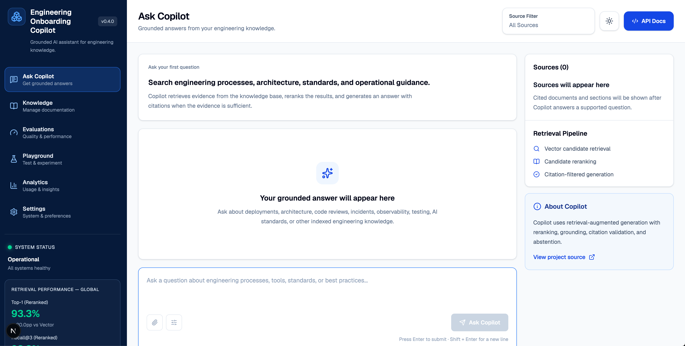
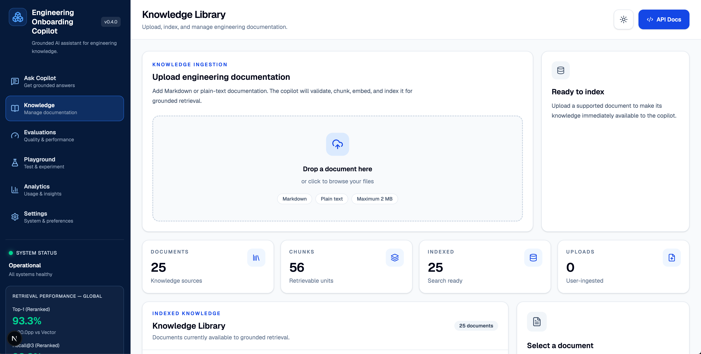
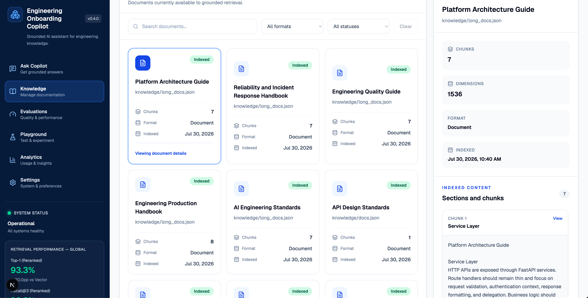
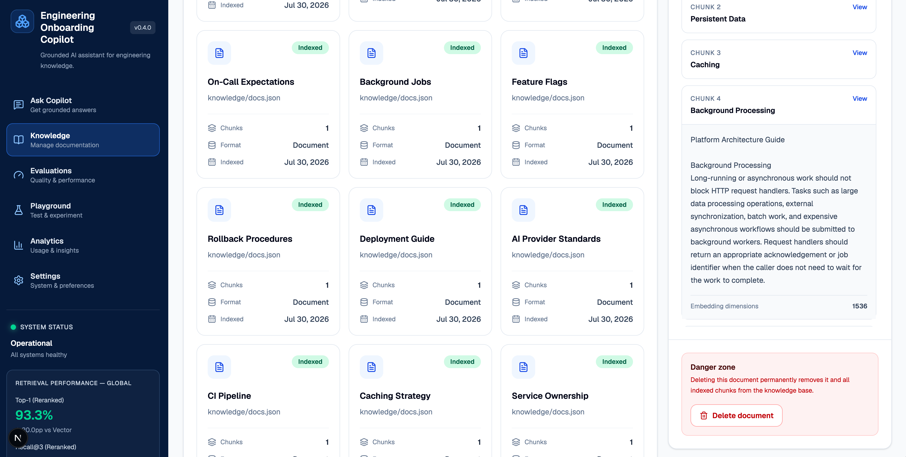

<h1 align="center">
Engineering Onboarding Copilot
</h1>

<p align="center">
A production-oriented, evaluated Retrieval-Augmented Generation (RAG) platform demonstrating semantic retrieval, LLM reranking, grounded generation, and enterprise AI engineering patterns.
</p>


</p>

---

## At a Glance

| Category        | Details                                               |
| --------------- | ----------------------------------------------------- |
| Frontend        | Next.js, React, TypeScript, Tailwind CSS              |
| Backend         | FastAPI, Python                                       |
| Database        | PostgreSQL + pgvector                                 |
| AI              | OpenAI Embeddings, LLM Reranking, Grounded Generation |
| Retrieval       | Section-aware Chunking, Vector Search, Reranking      |
| Knowledge       | Upload, Inspect, Search, Filter, Delete               |
| Testing         | pytest, Retrieval & Generation Evaluations            |
| UI              | Enterprise AI Knowledge Workspace                     |
| Current Version | v0.4.0                                                |

---

## Key Outcomes

- Built an evaluated Retrieval-Augmented Generation platform from the ground up.
- Improved Top-1 retrieval accuracy from **73.3% → 93.3%** using LLM reranking.
- Achieved **100% grounding accuracy** on the current evaluation suite.
- Designed an enterprise-style Next.js interface backed by a FastAPI service.
- Established repeatable retrieval and generation evaluation pipelines.

## Product Preview

The demonstration below shows the complete engineering workflow, including live question submission, semantic retrieval, grounded answer generation, citation rendering, and enterprise UI interactions.

### Live Product Demo

▶ **Watch the demo**

`assets/demo/engineering-onboarding-copilot-demo.mp4`

## Enterprise Interface

Engineering Onboarding Copilot provides a production-inspired interface for enterprise AI knowledge management. The application combines Retrieval-Augmented Generation (RAG), document ingestion, semantic search, and document inspection into a unified workflow.

### Ask Copilot

Grounded engineering Q&A with citation-aware retrieval.



---

### Knowledge Management Workspace

Upload, index, search, filter, and manage engineering documentation through a dedicated knowledge workspace.



---

### Document Inspector

Inspect indexed documents, metadata, embeddings, and chunk organization.



---

### Chunk-Level Inspection

Explore individual chunks exactly as they are stored in the vector database, including section boundaries, indexed text, and embedding metadata.



---

### Current Capabilities

- ✅ Drag-and-drop document ingestion
- ✅ Automatic document chunking
- ✅ OpenAI embedding generation
- ✅ PostgreSQL + pgvector indexing
- ✅ Grounded RAG retrieval
- ✅ Citation-aware responses
- ✅ Knowledge search
- ✅ Document filtering
- ✅ Knowledge base statistics
- ✅ Document metadata inspection
- ✅ Deep chunk inspection
- ✅ Safe document deletion
- ✅ Immediate retrieval from newly indexed knowledge

---

## Why This Exists

Engineering onboarding knowledge is often fragmented across documentation, codebases, operational runbooks, Slack conversations, meetings, and tribal knowledge.

A new engineer may need to answer questions such as:

- How should I release a production change?
- What happens during a customer-impacting incident?
- Should an API route call an external AI provider directly?
- What should reviewers evaluate during code review?
- How should production AI systems be evaluated?
- What is the correct rollback process?
- Where do persistent and cached data belong?
- When should an on-call engineer escalate?

A general-purpose LLM can answer these questions fluently, but fluency alone is not enough for internal engineering knowledge.

A trustworthy internal AI system should:

- retrieve the right evidence
- distinguish relevant evidence from semantic noise
- preserve document and section provenance
- cite the evidence used
- expose grounded and unsupported states clearly
- refuse to invent answers when the knowledge base does not support them
- measure retrieval and generation behavior through repeatable evaluations

That is the problem this project explores.

---

## Architecture

### Runtime Question-Answering Pipeline

```text
                     ┌─────────────────────┐
                     │    Next.js Client   │
                     └──────────┬──────────┘
                                │
              ┌─────────────────┴─────────────────┐
              │                                   │
              ▼                                   ▼
      Ask Copilot                         Knowledge Library
              │                                   │
              │                           Upload / List / Detail
              │                           Search / Filter / Delete
              │                                   │
              └─────────────────┬─────────────────┘
                                ▼
                     ┌─────────────────────┐
                     │       FastAPI       │
                     └──────────┬──────────┘
                                │
         ┌──────────────────────┴──────────────────────┐
         │                                             │
         ▼                                             ▼
   RAG Query Pipeline                         Ingestion Pipeline
         │                                             │
   Embed Question                               Validate File
         │                                             │
   Vector Retrieval                            Parse Content
         │                                             │
   LLM Reranking                               Section Chunking
         │                                             │
   Context Assembly                            Generate Embeddings
         │                                             │
   Grounded Generation                         Persist Document
         │                                             │
   Citation Filtering                          Persist Chunks
         │                                             │
         └──────────────────────┬──────────────────────┘
                                ▼
                     PostgreSQL + pgvector
```

### Document Ingestion Pipeline

```text
Knowledge Documents
        │
        ▼
Section-Aware Chunking
        │
        ▼
Embedding Generation
        │
        ▼
Document Metadata
        │
        ▼
PostgreSQL + pgvector
        │
        ▼
Indexed Knowledge Base
```

### Separation of Responsibilities

| Layer               | Responsibility                                                                       |
| ------------------- | ------------------------------------------------------------------------------------ |
| Next.js interface   | Collect questions and render answers, citations, loading states, and grounded status |
| FastAPI             | Validate requests and expose the application contract                                |
| Vector retrieval    | Retrieve a broad semantically relevant candidate set                                 |
| Reranker            | Order candidates by relevance to the exact user question                             |
| Context builder     | Format selected evidence and assign stable source identifiers                        |
| Grounded generation | Synthesize an answer using only supplied evidence                                    |
| Citation filtering  | Return only sources actually cited in the answer                                     |
| Abstention          | Decline unsupported questions instead of inventing company policy                    |
| Evaluation suites   | Measure retrieval quality and final-answer behavior                                  |

---

## Core Capabilities

### Semantic Retrieval

Documents and chunks are embedded and stored in PostgreSQL using pgvector.

At runtime, the user question is embedded into the same vector space and compared against stored chunk embeddings using cosine distance.

This allows semantically related questions to retrieve useful documentation even when the user and source document use different wording.

For example:

```text
User question:
"What does our backend stack look like?"

Relevant source:
"Platform Architecture Guide"
```

Literal keyword overlap may be weak, while embeddings can capture the semantic relationship.

---

### Section-Aware Chunking

Long documents are split along meaningful section boundaries rather than treated as one retrieval unit.

For example:

```text
Engineering Production Handbook
├── Release Preparation
├── CI Validation
├── Feature Flags
├── Database Migrations
├── Progressive Rollout
├── Health Validation
├── Rollback
└── Post-Deployment Monitoring
```

Each chunk preserves:

- the parent document title
- the section heading
- the section body
- the section name as structured metadata
- the chunk index
- the embedding

This improves retrieval precision by allowing the system to retrieve the exact section containing the answer instead of embedding an entire multi-topic handbook as one vector.

---

### LLM-Based Candidate Reranking

Vector search retrieves a broad candidate set.

An LLM-based reranker then evaluates those candidates against the exact question and selects the strongest evidence for generation.

```text
Question
   ↓
Vector Retrieval
   ↓
Top Candidate Chunks
   ↓
LLM Reranking
   ↓
Top Evidence Chunks
```

This separates:

```text
candidate recall
```

from:

```text
final evidence selection
```

The distinction matters because the correct evidence may be present in the initial candidate set without being ranked first.

---

### Context Assembly

The context layer converts retrieved chunks into a stable representation for the language model.

```text
[Source 1]
Document: Incident Escalation
Content:
...

[Source 2]
Document: Engineering Production Handbook
Section: Rollback
Content:
...
```

Each chunk receives a stable source identifier so the answer can cite evidence using:

```text
[Source 1]
[Source 2]
```

The source metadata is preserved separately from the generated answer.

---

### Grounded Answer Generation

The generation layer receives only selected evidence.

The model is instructed to:

- answer only from the supplied context
- cite factual claims
- avoid inventing source identifiers
- distinguish supported from unsupported questions
- prefer concise, actionable answers

Example:

```text
Notify the incident channel, assign an incident lead, document customer
impact, and prioritize mitigation before root-cause analysis. [Source 1]

If the deployment caused the issue, stop further rollout and determine
whether rollback is safer than forward remediation. [Source 2]
```

---

### Citation Filtering

Retrieval may return supporting evidence that the final answer does not use.

The service extracts cited source identifiers from the generated answer and returns only those source objects.

This avoids presenting retrieved-but-unused documents as evidence for the answer.

---

### Abstention

When retrieved evidence does not support the question, the system explicitly declines to answer.

Example:

```text
Question:
What is the company's parental leave policy?

Answer:
The provided context does not include information about the company's
parental leave policy.

Grounded: false
Sources: []
```

This is important because nearest-neighbor search always returns the nearest available content.

The system must distinguish:

```text
nearest available result
```

from:

```text
sufficient evidence to answer
```

---

### Live Enterprise Interface

The Next.js interface is connected to the FastAPI `/ask` endpoint.

It supports:

- live question submission
- staged retrieval, reranking, and generation feedback
- grounded and insufficient-evidence states
- cited source cards
- answer copy functionality
- response-time reporting
- retrieval benchmark visibility
- API documentation access
- responsive enterprise-style layout

The interface intentionally avoids displaying fabricated operational data.

Only information returned by the live backend is presented as dynamic evidence.

---

### Provider Abstraction

The model provider is separated from retrieval, generation orchestration, and HTTP concerns.

This allows future model implementations to evolve without rewriting the rest of the application architecture.

---

## Evaluation

Evaluation is treated as part of the architecture rather than an afterthought.

The project includes evaluation suites for:

- lexical retrieval
- vector retrieval
- long-document retrieval
- chunk-level retrieval
- reranked retrieval
- global corpus competition
- isolated long-document retrieval
- grounding behavior
- citation presence
- citation validity
- abstention behavior

The evaluation datasets are intended to serve as repeatable regression baselines.

They are not claims of general production accuracy.

---

## Architecture Evolution

Rather than designing the final architecture upfront, the system evolved through iterative measurement.

Each architectural change was introduced only after evaluation exposed a concrete limitation in retrieval quality, evidence selection, or answer grounding.

```text
Build
  ↓
Measure
  ↓
Discover Failure
  ↓
Improve Architecture
  ↓
Evaluate Again
```

This engineering approach kept the project focused on measurable improvements rather than speculative optimization.

---

### 1. Lexical Retrieval Baseline

The initial MVP used lightweight lexical retrieval.

This established the complete application flow before introducing additional infrastructure complexity.

```text
Question
→ Retrieval
→ Context
→ LLM
→ Answer
```

The objective was to validate the end-to-end pipeline before optimizing retrieval quality.

---

### 2. Vector Retrieval

The lexical baseline was replaced with embedding-based semantic retrieval backed by PostgreSQL and pgvector.

This enabled conceptually similar questions to retrieve relevant documentation even when wording differed significantly.

The system could now match meaning instead of relying solely on keyword overlap.

---

### 3. Retrieval Evaluation

A repeatable retrieval evaluation suite was introduced.

Instead of judging quality through manually selected demos, retrieval performance became measurable.

Metrics included:

- Top-1 Accuracy
- Recall@3
- Mean Reciprocal Rank (MRR)

Every future architectural change could now be validated objectively.

---

### 4. Multiple Relevant Sources

Evaluation cases evolved from requiring a single expected document to allowing multiple acceptable sources.

This prevented the benchmark from incorrectly penalizing alternative documents that were equally valid evidence.

The result was a more realistic evaluation framework.

---

### 5. LLM Reranking

Semantic retrieval became a two-stage pipeline.

```text
Question
      │
      ▼
Vector Retrieval
      │
Candidate Chunks
      │
      ▼
LLM Reranker
      │
      ▼
Highest Quality Evidence
```

Retrieval focuses on recall.

Reranking focuses on precision.

Separating these responsibilities significantly improved Top-1 retrieval quality.

---

### 6. Long-Document Stress Testing

Large handbook-style documents exposed an important architectural weakness.

Embedding an entire handbook into a single vector forced unrelated topics to compete for representation.

The initial benchmark produced:

| Retrieval Strategy         | Top-1 | Recall@3 |   MRR |
| -------------------------- | ----: | -------: | ----: |
| Whole-Document Vector      | 20.0% |    63.3% | 0.422 |
| Whole-Document + Reranking | 80.0% |    93.3% | 0.867 |

The bottleneck was document granularity rather than embedding quality.

---

### 7. Section-Aware Chunking

Long documents were split into semantically meaningful sections.

Example:

```text
Engineering Production Handbook
├── Release Preparation
├── CI Validation
├── Feature Flags
├── Database Migrations
├── Progressive Rollout
├── Health Validation
├── Rollback
└── Post-Deployment Monitoring
```

Each chunk preserves:

- parent document
- section heading
- section body
- chunk index
- metadata
- embedding

This substantially improved retrieval precision while maintaining document provenance.

---

### 8. Source-Aware Evaluation

The retrieval layer gained optional source filtering.

Evaluation runners added support for:

```bash
python -m evals.run_chunk_eval --mode global
python -m evals.run_chunk_eval --mode isolated
```

This separated chunking quality from competition across the entire knowledge base.

---

### 9. Grounded Generation

Retrieval was connected to a dedicated grounded generation layer.

Responsibilities include:

- structured context assembly
- answer synthesis
- source preservation
- citation filtering
- abstention handling
- response validation

Generation became evidence-driven rather than prompt-driven.

---

### 10. FastAPI Contract

The complete pipeline was exposed through a typed FastAPI API.

```json
{
  "answer": "...",
  "grounded": true,
  "sources": []
}
```

Typed request and response models established a stable application contract for both testing and frontend integration.

---

### 11. Automated Testing

Automated API tests verify:

- health endpoint behavior
- grounded responses
- abstention behavior
- citation mapping
- request validation
- error handling

Generation evaluation extends testing beyond retrieval quality alone.

---

### 12. Enterprise Workspace

The project evolved from Swagger-based API interaction into a production-style Next.js workspace.

The interface exposes:

- grounded answers
- cited evidence
- retrieval progress
- loading stages
- response timing
- benchmark visibility
- insufficient-evidence states

The result is no longer simply a backend API.

It is a complete enterprise AI application demonstrating retrieval, evaluation, grounded generation, and production-ready user experience.

---

The final architecture is the product of measured iteration rather than upfront design.

Each layer exists because an earlier evaluation exposed a concrete limitation, resulting in a system whose behavior is explainable, measurable, and continuously improvable.

### Initial Retrieval Benchmark

The initial benchmark compared keyword and vector retrieval across direct, paraphrased, semantic, and difficult questions.

| Retrieval Strategy | Top-1 | Recall@3 |   MRR |
| ------------------ | ----: | -------: | ----: |
| Keyword Retrieval  | 65.0% |    63.3% | 0.750 |
| Vector Retrieval   | 90.0% |    95.8% | 0.950 |

Vector retrieval materially improved paraphrase and semantic matching.

---

### Global Chunk-Level Retrieval

Evaluation against the complete mixed corpus:

| Retrieval Strategy |     Top-1 |  Recall@3 |       MRR |
| ------------------ | --------: | --------: | --------: |
| Vector Retrieval   |     73.3% |     86.7% |     0.867 |
| Vector + Reranking | **93.3%** | **93.3%** | **0.967** |

Reranking improved global Top-1 accuracy by 20 percentage points.

The global benchmark is intentionally difficult because specialized short documents compete with sections inside larger handbook documents.

---

### Isolated Long-Document Retrieval

Evaluation restricted to the long-document corpus:

| Retrieval Strategy |      Top-1 |  Recall@3 |       MRR |
| ------------------ | ---------: | --------: | --------: |
| Vector Retrieval   |     100.0% |     90.0% |     1.000 |
| Vector + Reranking | **100.0%** | **96.7%** | **1.000** |

The isolated benchmark measures section-aware chunking and ranking quality without competition from specialized short documents.

---

### Generation Evaluation

Current generation evaluation:

| Metric              |         Result |
| ------------------- | -------------: |
| Grounding Accuracy  | **100% (6/6)** |
| Citation Presence   | **100% (4/4)** |
| Citation Validity   | **100% (4/4)** |
| Abstention Accuracy | **100% (2/2)** |

These results apply to the current curated evaluation dataset and are intended as regression baselines rather than universal model-accuracy claims.

---

## Technology Stack

### Frontend

- Next.js
- React
- TypeScript
- Tailwind CSS
- Lucide icons

### Backend

- Python
- FastAPI
- Pydantic

### AI

- OpenAI embeddings
- OpenAI language models
- Retrieval-Augmented Generation
- LLM-based reranking
- Grounded Answer Generation
- Citation Extraction and Filtering
- Abstention Handling

### Retrieval

- PostgreSQL
- pgvector
- cosine-distance vector search
- section-aware chunking
- source-aware retrieval

### Infrastructure

- Docker
- Docker Compose
- Reproducible PostgreSQL Initialization

### Quality

- pytest
- FastAPI contract tests
- retrieval evaluation datasets
- long-document evaluation
- chunk-level evaluation
- generation evaluation
- Top-1, Recall@K, and MRR metrics

---

## Project Structure

```text
assets/
├── demo/
│   └── engineering-onboarding-copilot-demo.mp4
├── screenshots/
│   ├── ask-copilot.png
│   ├── deep-chunk-inspection.png
│   ├── document-inspection.png
│   ├── knowledge-management.png
│   └── v0.3-enterprise-ui.png
└── diagrams/

frontend/ # Enterprise Next.js application
├── app/  # FastAPI + RAG backend
│   ├── evaluations/
│   │   └── page.tsx
│   ├── knowledge/
│   │   └── page.tsx
│   ├── playground/
│   │   └── page.tsx
│   ├── globals.css
│   ├── layout.tsx
│   └── page.tsx
├── components/
│   ├── knowledge/
│   │   ├── document-card.tsx
│   │   ├── document-details-panel.tsx
│   │   ├── document-filters.tsx
│   │   ├── document-library.tsx
│   │   ├── knowledge-stats.tsx
│   │   ├── knowledge-workspace.tsx
│   │   ├── upload-dropzone.tsx
│   │   └── upload-result-card.tsx
│   ├── answer-card.tsx
│   ├── application-layout.tsx
│   ├── ask-form.tsx
│   ├── ask-workspace.tsx
│   ├── metrics-card.tsx
│   ├── question-card.tsx
│   ├── sidebar.tsx
│   ├── source-panel.tsx
│   └── topbar.tsx
├── data/
│   └── navigation.ts
├── lib/
│   ├── api.ts
│   └── types.ts
├── package.json
└── tsconfig.json

app/
├── providers/
├── chunking.py
├── config.py
├── context.py
├── database.py
├── documents.py
├── embeddings.py
├── grounded_answer.py
├── ingestion.py
├── main.py
├── models.py
├── reranked_retrieval.py
├── reranker.py
├── retrieval.py
├── service.py
└── vector_retrieval.py

db/
└── init.sql

evals/ # Retrieval and generation benchmarks
├── generation_cases.json
├── long_doc_cases.json
├── long_doc_chunk_cases.json
├── retrieval_cases.json
├── run_chunk_eval.py
├── run_generation_eval.py
├── run_long_doc_eval.py
└── run_retrieval_eval.py

knowledge/ # Example engineering documentation
├── docs.json
└── long_docs.json

scripts/  # Ingestion and testing utilities
├── ingest.py
├── ingest_long_docs.py
├── test_chunking.py
├── test_context.py
├── test_grounded_answer.py
├── test_reranking.py
└── test_retrieval.py

tests/
└── test_api.py
```

---

## Getting Started

### Portfolio

https://portfolio-2026-iota-seven.vercel.app/work/engineering-onboarding-copilot

### GitHub Repository

https://github.com/Dorani/engineering-onboarding-copilot

### Local Development

Frontend

http://localhost:3000

Backend

http://127.0.0.1:8000/docs

### Prerequisites

- Python 3.12+
- Node.js
- npm
- Docker Desktop
- OpenAI API credentials

---

### 1. Clone the Repository

```bash
git clone https://github.com/Dorani/engineering-onboarding-copilot.git
cd engineering-onboarding-copilot
```

---

### 2. Configure the Python Environment

```bash
python -m venv .venv
source .venv/bin/activate

pip install -r requirements.txt
```

Create the backend environment file:

```bash
cp .env.example .env
```

Add the required credentials and configuration to `.env`.

---

### 3. Start PostgreSQL and pgvector

```bash
docker compose up -d
```

The database initialization script automatically creates:

- the pgvector extension
- the `documents` table
- the `chunks` table
- the section metadata column
- the vector column
- required indexes and constraints

---

### 4. Ingest the Knowledge Base

```bash
python -m scripts.ingest
python -m scripts.ingest_long_docs
```

---

### 5. Start the FastAPI Backend

```bash
uvicorn app.main:app --reload
```

API documentation:

```text
http://127.0.0.1:8000/docs
```

Health endpoint:

```text
http://127.0.0.1:8000/health
```

---

### 6. Configure the Frontend

Open another terminal:

```bash
cd frontend
npm install
```

Create `frontend/.env.local`:

```bash
printf 'NEXT_PUBLIC_API_BASE_URL=http://127.0.0.1:8000\n' > .env.local
```

---

### 7. Start the Next.js Frontend

```bash
npm run dev
```

Open:

```text
http://localhost:3000
```

---

## API Endpoints

| Method   | Endpoint                   | Purpose                                  |
| -------- | -------------------------- | ---------------------------------------- |
| `GET`    | `/health`                  | Service health check                     |
| `POST`   | `/ask`                     | Grounded question answering              |
| `POST`   | `/documents/upload`        | Upload and index a knowledge document    |
| `GET`    | `/documents`               | List indexed documents                   |
| `GET`    | `/documents/{document_id}` | Inspect document metadata and chunks     |
| `DELETE` | `/documents/{document_id}` | Delete a document and its indexed chunks |

Interactive OpenAPI documentation is available locally at:

````text
http://127.0.0.1:8000/docs

## API Example

### Request

```bash
curl -X POST http://127.0.0.1:8000/ask \
  -H "Content-Type: application/json" \
  -d '{
    "question": "My deployment is affecting customers. What should the team do?"
  }'
````

### Example Response

```json
{
  "answer": "Notify the incident channel, assign an incident lead, and prioritize mitigation before root-cause analysis. [Source 1]",
  "grounded": true,
  "sources": [
    {
      "id": 1,
      "title": "Incident Escalation",
      "section": null,
      "excerpt": "If a production issue affects customers..."
    }
  ]
}
```

---

## Running Tests and Evaluations

### API Tests

```bash
pytest tests/test_api.py -v
```

Or run the complete Python test suite:

```bash
pytest -v
```

---

### Retrieval Evaluation

```bash
python -m evals.run_retrieval_eval
```

---

### Long-Document Evaluation

```bash
python -m evals.run_long_doc_eval
```

---

### Global Chunk Evaluation

```bash
python -m evals.run_chunk_eval --mode global
```

---

### Isolated Chunk Evaluation

```bash
python -m evals.run_chunk_eval --mode isolated
```

---

### Generation Evaluation

```bash
python -m evals.run_generation_eval
```

---

### Frontend Validation

```bash
cd frontend

npm run lint
npm run build
```

---

## Enterprise Engineering Principles

This project intentionally emphasizes engineering practices commonly expected in production AI systems:

- Evidence over plausible generation
- Evaluation before optimization
- Clear service boundaries
- Reproducible infrastructure
- Typed API contracts
- Failure-safe behavior
- Replaceable model providers
- Measurable retrieval quality
- Observable system behavior

These principles influenced every architectural decision throughout the project.

## Design Principles

### Measure Before Optimizing

Architectural changes are evaluated against repeatable datasets rather than judged from individual demonstrations.

### Separate Retrieval from Generation

Poor answers may originate from evidence retrieval or answer synthesis.

Evaluating them independently makes failures easier to diagnose.

### Retrieve Broadly, Select Carefully

Vector retrieval provides candidate recall.

Reranking determines which evidence should reach generation.

### Chunk Around Meaning

Section-aware chunks preserve semantic boundaries and make retrieved evidence easier to understand, evaluate, and cite.

### Ground or Abstain

The system should distinguish between having relevant evidence and merely finding the nearest available document.

### Preserve Provenance

Document and section metadata survive retrieval so answers can identify where the evidence originated.

### Return Only Used Evidence

Retrieved-but-unused documents should not be presented as support for the generated answer.

### Keep Boundaries Replaceable

Retrieval, model providers, context assembly, generation, and HTTP concerns remain separated so individual components can evolve independently.

### Do Not Fabricate Operational Data

The interface should only present metrics, sources, and diagnostics that are supported by the backend or verified evaluation artifacts.

---

```md
## Current Capabilities

The current release combines an evaluated RAG pipeline with a live enterprise knowledge-management workspace.

### Ask Copilot

- live engineering questions
- semantic vector retrieval
- LLM-based candidate reranking
- section-aware evidence retrieval
- grounded answer generation
- inline citations
- citation filtering
- explicit abstention
- cited source cards
- staged retrieval and generation feedback
- response-time reporting
- visible retrieval benchmark metrics

### Knowledge Management

- drag-and-drop Markdown and plain-text ingestion
- upload validation
- section-aware chunk generation
- automatic embedding generation
- PostgreSQL + pgvector persistence
- persistent Knowledge Library
- document search
- format filtering
- status filtering
- live document and chunk statistics
- document details inspector
- chunk-level content inspection
- embedding-dimension visibility
- safe document deletion
- cascade cleanup of indexed chunks
- immediate retrieval from newly uploaded documents

### Platform

- route-based Next.js workspace architecture
- typed FastAPI contracts
- provider abstraction
- Dockerized PostgreSQL + pgvector
- automated API tests
- retrieval evaluation suites
- generation evaluation suites

### Not Yet Included

The current release does not yet include:

- PDF ingestion
- DOCX ingestion
- hybrid lexical + vector retrieval
- user authentication
- role-based access control
- background ingestion workers
- document versioning
- multiple knowledge bases
- conversation history
- production observability and tracing
- Slack or Teams integration

## These are planned extensions rather than capabilities implied to exist today.

## Roadmap

### ✅ v0.1 — API MVP

- FastAPI application
- model-provider abstraction
- lexical retrieval baseline
- grounded context flow
- initial API tests

### ✅ v0.2 — Evaluated RAG Core

- PostgreSQL and pgvector
- embedding-based vector retrieval
- LLM-based reranking
- long-document stress testing
- section-aware chunking
- source-aware retrieval
- grounded generation
- inline citations
- citation filtering
- abstention
- retrieval and generation evaluations
- reproducible database initialization

### ✅ v0.3 — Enterprise Interface

- Next.js workspace
- live FastAPI integration
- staged loading pipeline
- grounded and abstention states
- cited source panel
- response-time reporting
- visible evaluation metrics
- production-style responsive UX

### ✅ v0.4 — Knowledge Management

- Dynamic document ingestion
- Persistent Knowledge Library
- Document inspection
- Chunk visibility
- Search and filters
- Knowledge statistics
- Document deletion

### 🔜 v0.5 — Advanced Retrieval & Documents

- PDF ingestion
- DOCX ingestion
- Hybrid lexical + vector retrieval
- Retrieval debugging
- Re-indexing
- Richer evaluation dashboards

### Later

- Background ingestion workers
- Authentication and RBAC
- Multiple knowledge bases
- Conversation history
- Observability and tracing

---

## Release History

### v0.1.0

Initial lexical retrieval MVP with grounded answer generation.

### v0.2.0

Introduced semantic retrieval, pgvector, reranking, section-aware chunking, grounded generation, citation filtering, abstention, and automated evaluation.

### v0.3.0 — Enterprise Workspace

- Introduced production-style Next.js frontend
- Connected live FastAPI `/ask` endpoint
- Added staged retrieval and generation feedback
- Added grounded/abstention UI states
- Added cited source panel
- Added response timing
- Added product demo

## 🚀 v0.4 — Knowledge Management

v0.4 turns the project from a curated RAG demo into a dynamic enterprise knowledge platform.

### New capabilities

- Drag-and-drop Markdown and plain-text ingestion
- Automatic document validation
- Section-aware chunking
- OpenAI embedding generation
- PostgreSQL + pgvector indexing
- Persistent Knowledge Library
- Document search and filtering
- Live knowledge statistics
- Document details inspector
- Chunk-level inspection
- Embedding-dimension visibility
- Document deletion with cascade cleanup
- Immediate retrieval of newly uploaded knowledge

---
```
