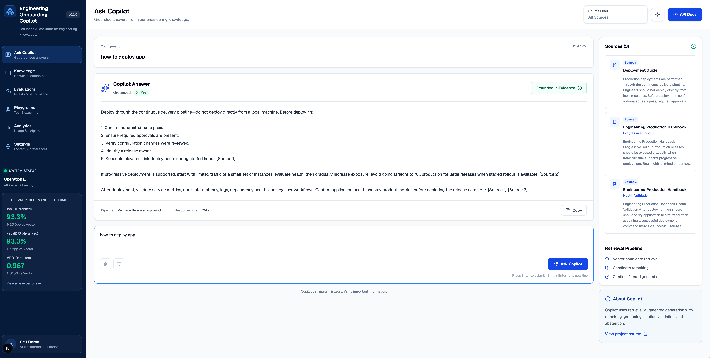

# Engineering Onboarding Copilot

A production-oriented Retrieval-Augmented Generation platform for helping engineers understand internal documentation, architecture, production practices, reliability standards, and engineering conventions.

The system combines a Next.js enterprise interface with FastAPI, PostgreSQL and pgvector, section-aware chunking, semantic retrieval, LLM-based reranking, grounded generation, citations, abstention, and repeatable retrieval and generation evaluations.

---

## Product Preview



### Highlights

- Production-style Next.js enterprise interface
- FastAPI and Pydantic API layer
- PostgreSQL with pgvector semantic search
- Section-aware long-document chunking
- LLM-based candidate reranking
- Grounded answer generation with inline citations
- Citation filtering and explicit abstention
- Reproducible Docker-based database initialization
- Retrieval, chunk-level, and generation evaluation suites
- Automated API contract tests

---

## Why This Exists

Engineering onboarding knowledge is often fragmented across documentation, codebases, operational runbooks, Slack conversations, meetings, and tribal knowledge.

A new engineer may need to answer questions such as:

- How should I release a production change?
- What happens during a customer-impacting incident?
- Should an API route call an external AI provider directly?
- What should reviewers evaluate during code review?
- How should production AI systems be evaluated?
- What is the correct rollback process?
- Where do persistent and cached data belong?
- When should an on-call engineer escalate?

A general-purpose LLM can answer these questions fluently, but fluency alone is not enough for internal engineering knowledge.

A trustworthy internal AI system should:

- retrieve the right evidence
- distinguish relevant evidence from semantic noise
- preserve document and section provenance
- cite the evidence used
- expose grounded and unsupported states clearly
- refuse to invent answers when the knowledge base does not support them
- measure retrieval and generation behavior through repeatable evaluations

That is the problem this project explores.

---

## Architecture

### Runtime Question-Answering Pipeline

```text
                         ┌──────────────────────┐
                         │         User         │
                         └──────────┬───────────┘
                                    │
                                    ▼
                         ┌──────────────────────┐
                         │      Next.js UI      │
                         │ Enterprise Workspace │
                         └──────────┬───────────┘
                                    │
                              POST /ask
                                    │
                                    ▼
                         ┌──────────────────────┐
                         │       FastAPI        │
                         │ Pydantic Validation  │
                         └──────────┬───────────┘
                                    │
                                    ▼
                         ┌──────────────────────┐
                         │ Grounded Answer      │
                         │ Service              │
                         └──────────┬───────────┘
                                    │
                                    ▼
                         ┌──────────────────────┐
                         │ Vector Retrieval     │
                         │ PostgreSQL + pgvector│
                         └──────────┬───────────┘
                                    │
                              Candidate Set
                                    │
                                    ▼
                         ┌──────────────────────┐
                         │    LLM Reranker      │
                         └──────────┬───────────┘
                                    │
                               Top Evidence
                                    │
                                    ▼
                         ┌──────────────────────┐
                         │ Context Assembly     │
                         └──────────┬───────────┘
                                    │
                                    ▼
                         ┌──────────────────────┐
                         │ Grounded Generation  │
                         └──────────┬───────────┘
                                    │
                                    ▼
                         ┌──────────────────────┐
                         │ Citation Filtering   │
                         │ + Abstention         │
                         └──────────┬───────────┘
                                    │
                                    ▼
                         Answer + Grounded Status
                              + Used Sources
```

### Document Ingestion Pipeline

```text
Knowledge Documents
        │
        ▼
Section-Aware Chunking
        │
        ▼
Embedding Generation
        │
        ▼
Document Metadata
        │
        ▼
PostgreSQL + pgvector
        │
        ▼
Indexed Knowledge Base
```

### Separation of Responsibilities

| Layer               | Responsibility                                                                       |
| ------------------- | ------------------------------------------------------------------------------------ |
| Next.js interface   | Collect questions and render answers, citations, loading states, and grounded status |
| FastAPI             | Validate requests and expose the application contract                                |
| Vector retrieval    | Retrieve a broad semantically relevant candidate set                                 |
| Reranker            | Order candidates by relevance to the exact user question                             |
| Context builder     | Format selected evidence and assign stable source identifiers                        |
| Grounded generation | Synthesize an answer using only supplied evidence                                    |
| Citation filtering  | Return only sources actually cited in the answer                                     |
| Abstention          | Decline unsupported questions instead of inventing company policy                    |
| Evaluation suites   | Measure retrieval quality and final-answer behavior                                  |

---

## Core Capabilities

### Semantic Retrieval

Documents and chunks are embedded and stored in PostgreSQL using pgvector.

At runtime, the user question is embedded into the same vector space and compared against stored chunk embeddings using cosine distance.

This allows semantically related questions to retrieve useful documentation even when the user and source document use different wording.

For example:

```text
User question:
"What does our backend stack look like?"

Relevant source:
"Platform Architecture Guide"
```

Literal keyword overlap may be weak, while embeddings can capture the semantic relationship.

---

### Section-Aware Chunking

Long documents are split along meaningful section boundaries rather than treated as one retrieval unit.

For example:

```text
Engineering Production Handbook
├── Release Preparation
├── CI Validation
├── Feature Flags
├── Database Migrations
├── Progressive Rollout
├── Health Validation
├── Rollback
└── Post-Deployment Monitoring
```

Each chunk preserves:

- the parent document title
- the section heading
- the section body
- the section name as structured metadata
- the chunk index
- the embedding

This improves retrieval precision by allowing the system to retrieve the exact section containing the answer instead of embedding an entire multi-topic handbook as one vector.

---

### LLM-Based Candidate Reranking

Vector search retrieves a broad candidate set.

An LLM-based reranker then evaluates those candidates against the exact question and selects the strongest evidence for generation.

```text
Question
   ↓
Vector Retrieval
   ↓
Top Candidate Chunks
   ↓
LLM Reranking
   ↓
Top Evidence Chunks
```

This separates:

```text
candidate recall
```

from:

```text
final evidence selection
```

The distinction matters because the correct evidence may be present in the initial candidate set without being ranked first.

---

### Context Assembly

The context layer converts retrieved chunks into a stable representation for the language model.

```text
[Source 1]
Document: Incident Escalation
Content:
...

[Source 2]
Document: Engineering Production Handbook
Section: Rollback
Content:
...
```

Each chunk receives a stable source identifier so the answer can cite evidence using:

```text
[Source 1]
[Source 2]
```

The source metadata is preserved separately from the generated answer.

---

### Grounded Answer Generation

The generation layer receives only selected evidence.

The model is instructed to:

- answer only from the supplied context
- cite factual claims
- avoid inventing source identifiers
- distinguish supported from unsupported questions
- prefer concise, actionable answers

Example:

```text
Notify the incident channel, assign an incident lead, document customer
impact, and prioritize mitigation before root-cause analysis. [Source 1]

If the deployment caused the issue, stop further rollout and determine
whether rollback is safer than forward remediation. [Source 2]
```

---

### Citation Filtering

Retrieval may return supporting evidence that the final answer does not use.

The service extracts cited source identifiers from the generated answer and returns only those source objects.

This avoids presenting retrieved-but-unused documents as evidence for the answer.

---

### Abstention

When retrieved evidence does not support the question, the system explicitly declines to answer.

Example:

```text
Question:
What is the company's parental leave policy?

Answer:
The provided context does not include information about the company's
parental leave policy.

Grounded: false
Sources: []
```

This is important because nearest-neighbor search always returns the nearest available content.

The system must distinguish:

```text
nearest available result
```

from:

```text
sufficient evidence to answer
```

---

### Live Enterprise Interface

The Next.js interface is connected to the FastAPI `/ask` endpoint.

It supports:

- live question submission
- staged retrieval, reranking, and generation feedback
- grounded and insufficient-evidence states
- cited source cards
- answer copy functionality
- response-time reporting
- retrieval benchmark visibility
- API documentation access
- responsive enterprise-style layout

The interface intentionally avoids displaying fabricated operational data.

Only information returned by the live backend is presented as dynamic evidence.

---

### Provider Abstraction

The model provider is separated from retrieval, generation orchestration, and HTTP concerns.

This allows future model implementations to evolve without rewriting the rest of the application architecture.

---

## Evaluation

Evaluation is treated as part of the architecture rather than an afterthought.

The project includes evaluation suites for:

- lexical retrieval
- vector retrieval
- long-document retrieval
- chunk-level retrieval
- reranked retrieval
- global corpus competition
- isolated long-document retrieval
- grounding behavior
- citation presence
- citation validity
- abstention behavior

The evaluation datasets are intended to serve as repeatable regression baselines.

They are not claims of general production accuracy.

---

### Initial Retrieval Benchmark

The initial benchmark compared keyword and vector retrieval across direct, paraphrased, semantic, and difficult questions.

| Retrieval Strategy | Top-1 | Recall@3 |   MRR |
| ------------------ | ----: | -------: | ----: |
| Keyword Retrieval  | 65.0% |    63.3% | 0.750 |
| Vector Retrieval   | 90.0% |    95.8% | 0.950 |

Vector retrieval materially improved paraphrase and semantic matching.

---

### Global Chunk-Level Retrieval

Evaluation against the complete mixed corpus:

| Retrieval Strategy |     Top-1 |  Recall@3 |       MRR |
| ------------------ | --------: | --------: | --------: |
| Vector Retrieval   |     73.3% |     86.7% |     0.867 |
| Vector + Reranking | **93.3%** | **93.3%** | **0.967** |

Reranking improved global Top-1 accuracy by 20 percentage points.

The global benchmark is intentionally difficult because specialized short documents compete with sections inside larger handbook documents.

---

### Isolated Long-Document Retrieval

Evaluation restricted to the long-document corpus:

| Retrieval Strategy |      Top-1 |  Recall@3 |       MRR |
| ------------------ | ---------: | --------: | --------: |
| Vector Retrieval   |     100.0% |     90.0% |     1.000 |
| Vector + Reranking | **100.0%** | **96.7%** | **1.000** |

The isolated benchmark measures section-aware chunking and ranking quality without competition from specialized short documents.

---

### Generation Evaluation

Current generation evaluation:

| Metric              |         Result |
| ------------------- | -------------: |
| Grounding Accuracy  | **100% (6/6)** |
| Citation Presence   | **100% (4/4)** |
| Citation Validity   | **100% (4/4)** |
| Abstention Accuracy | **100% (2/2)** |

These results apply to the current curated evaluation dataset and are intended as regression baselines rather than universal model-accuracy claims.

---

## Engineering Evolution

The system was developed incrementally.

Each major architecture change was introduced because measurement exposed a specific limitation.

```text
Build
  ↓
Measure
  ↓
Discover Failure
  ↓
Improve Architecture
  ↓
Evaluate Again
```

### 1. Lexical Retrieval Baseline

The initial MVP used lightweight lexical retrieval.

This established the complete application flow before introducing infrastructure complexity:

```text
Question
→ Retrieval
→ Context
→ LLM
→ Answer
```

---

### 2. Vector Retrieval

The lexical baseline was replaced with embedding-based semantic retrieval backed by PostgreSQL and pgvector.

This allowed conceptually similar questions to retrieve relevant documentation even when the wording differed.

---

### 3. Retrieval Evaluation

A repeatable evaluation dataset was introduced to measure retrieval behavior instead of relying on manually selected demonstrations.

Metrics included:

- Top-1 accuracy
- Recall@K
- Mean Reciprocal Rank

---

### 4. Multiple Relevant Sources

The evaluation format evolved from one `expected_document` to multiple `relevant_documents`.

This prevented the benchmark from incorrectly penalizing alternative documents that were also valid evidence.

---

### 5. Reranking

Vector retrieval was expanded into candidate retrieval followed by reranking.

This improved final evidence ordering and separated broad semantic recall from final relevance selection.

---

### 6. Long-Document Stress Testing

Longer handbook-style documents exposed a limitation in whole-document embeddings.

A single vector had to represent many unrelated sections.

The initial whole-document long-doc benchmark produced:

| Retrieval Strategy         | Top-1 | Recall@3 |   MRR |
| -------------------------- | ----: | -------: | ----: |
| Whole-Document Vector      | 20.0% |    63.3% | 0.422 |
| Whole-Document + Reranking | 80.0% |    93.3% | 0.867 |

The result exposed retrieval granularity as an architectural bottleneck.

---

### 7. Section-Aware Chunking

Long documents were split along semantic section boundaries.

Chunk metadata preserves both document and section identity:

```text
Engineering Production Handbook > Database Migrations
Engineering Production Handbook > Rollback
Engineering Quality Guide > Logging
AI Engineering Standards > Prompt Management
```

This produced a substantial improvement in chunk-level retrieval quality.

---

### 8. Source-Aware Evaluation

The retrieval layer gained optional source filtering.

The evaluation runner added:

```bash
python -m evals.run_chunk_eval --mode global
python -m evals.run_chunk_eval --mode isolated
```

This made it possible to distinguish chunking quality from competition across the full knowledge base.

---

### 9. Grounded Generation

Retrieved evidence was connected to a dedicated grounded-answer layer that:

- assembles structured context
- generates answers from retrieved evidence
- preserves source identities
- filters unused citations
- distinguishes supported from unsupported questions
- fails closed when the output contract is violated

---

### 10. FastAPI Contract

The complete pipeline is exposed through FastAPI using Pydantic request and response models.

The `/ask` endpoint returns:

```json
{
  "answer": "...",
  "grounded": true,
  "sources": []
}
```

---

### 11. API and Generation Tests

API tests verify:

- health endpoint behavior
- grounded answers
- abstention
- citation/source response mapping
- too-short input validation
- missing input validation

Generation evals verify behavior beyond retrieval alone.

---

### 12. Enterprise Interface

The project evolved from Swagger-based API interaction to a live Next.js enterprise workspace.

The UI exposes:

- the grounded answer
- cited evidence
- the retrieval pipeline
- loading stages
- response time
- global benchmark metrics
- insufficient-evidence behavior

This turns the backend architecture into a usable product experience.

---

## Technology Stack

### Frontend

- Next.js
- React
- TypeScript
- Tailwind CSS
- Lucide icons

### Backend

- Python
- FastAPI
- Pydantic

### AI

- OpenAI embeddings
- OpenAI language models
- Retrieval-Augmented Generation
- LLM-based reranking
- grounded answer generation
- citation extraction and filtering
- abstention behavior

### Retrieval

- PostgreSQL
- pgvector
- cosine-distance vector search
- section-aware chunking
- source-aware retrieval

### Infrastructure

- Docker
- Docker Compose
- reproducible PostgreSQL initialization

### Quality

- pytest
- FastAPI contract tests
- retrieval evaluation datasets
- long-document evaluation
- chunk-level evaluation
- generation evaluation
- Top-1, Recall@K, and MRR metrics

---

## Project Structure

```text
assets/
├── demo/
├── diagrams/
└── screenshots/
    └── v0.3-enterprise-ui.png

frontend/
├── app/
│   ├── globals.css
│   ├── layout.tsx
│   └── page.tsx
├── components/
│   ├── answer-card.tsx
│   ├── app-shell.tsx
│   ├── ask-form.tsx
│   ├── metrics-card.tsx
│   ├── question-card.tsx
│   ├── sidebar.tsx
│   ├── source-panel.tsx
│   └── topbar.tsx
├── data/
│   └── navigation.ts
├── lib/
│   ├── api.ts
│   └── types.ts
├── public/
├── package.json
└── tsconfig.json

app/
├── chunking.py
├── config.py
├── context.py
├── database.py
├── embeddings.py
├── grounded_answer.py
├── main.py
├── models.py
├── providers/
├── reranked_retrieval.py
├── reranker.py
├── retrieval.py
├── service.py
└── vector_retrieval.py

db/
└── init.sql

evals/
├── generation_cases.json
├── long_doc_cases.json
├── long_doc_chunk_cases.json
├── retrieval_cases.json
├── run_chunk_eval.py
├── run_generation_eval.py
├── run_long_doc_eval.py
└── run_retrieval_eval.py

knowledge/
├── docs.json
└── long_docs.json

scripts/
├── ingest.py
├── ingest_long_docs.py
├── test_chunking.py
├── test_context.py
├── test_grounded_answer.py
├── test_reranking.py
└── test_retrieval.py

tests/
└── test_api.py
```

---

## Running Locally

### Prerequisites

- Python 3.12+
- Node.js
- npm
- Docker Desktop
- OpenAI API credentials

---

### 1. Clone the Repository

```bash
git clone https://github.com/Dorani/engineering-onboarding-copilot.git
cd engineering-onboarding-copilot
```

---

### 2. Configure the Python Environment

```bash
python -m venv .venv
source .venv/bin/activate

pip install -r requirements.txt
```

Create the backend environment file:

```bash
cp .env.example .env
```

Add the required credentials and configuration to `.env`.

---

### 3. Start PostgreSQL and pgvector

```bash
docker compose up -d
```

The database initialization script automatically creates:

- the pgvector extension
- the `documents` table
- the `chunks` table
- the section metadata column
- the vector column
- required indexes and constraints

---

### 4. Ingest the Knowledge Base

```bash
python -m scripts.ingest
python -m scripts.ingest_long_docs
```

---

### 5. Start the FastAPI Backend

```bash
uvicorn app.main:app --reload
```

API documentation:

```text
http://127.0.0.1:8000/docs
```

Health endpoint:

```text
http://127.0.0.1:8000/health
```

---

### 6. Configure the Frontend

Open another terminal:

```bash
cd frontend
npm install
```

Create `frontend/.env.local`:

```bash
printf 'NEXT_PUBLIC_API_BASE_URL=http://127.0.0.1:8000\n' > .env.local
```

---

### 7. Start the Next.js Frontend

```bash
npm run dev
```

Open:

```text
http://localhost:3000
```

---

## API Example

### Request

```bash
curl -X POST http://127.0.0.1:8000/ask \
  -H "Content-Type: application/json" \
  -d '{
    "question": "My deployment is affecting customers. What should the team do?"
  }'
```

### Example Response

```json
{
  "answer": "Notify the incident channel, assign an incident lead, and prioritize mitigation before root-cause analysis. [Source 1]",
  "grounded": true,
  "sources": [
    {
      "id": 1,
      "title": "Incident Escalation",
      "section": null,
      "excerpt": "If a production issue affects customers..."
    }
  ]
}
```

---

## Running Tests and Evaluations

### API Tests

```bash
pytest tests/test_api.py -v
```

Or run the complete Python test suite:

```bash
pytest -v
```

---

### Retrieval Evaluation

```bash
python -m evals.run_retrieval_eval
```

---

### Long-Document Evaluation

```bash
python -m evals.run_long_doc_eval
```

---

### Global Chunk Evaluation

```bash
python -m evals.run_chunk_eval --mode global
```

---

### Isolated Chunk Evaluation

```bash
python -m evals.run_chunk_eval --mode isolated
```

---

### Generation Evaluation

```bash
python -m evals.run_generation_eval
```

---

### Frontend Validation

```bash
cd frontend

npm run lint
npm run build
```

---

## Design Principles

### Measure Before Optimizing

Architectural changes are evaluated against repeatable datasets rather than judged from individual demonstrations.

### Separate Retrieval from Generation

Poor answers may originate from evidence retrieval or answer synthesis.

Evaluating them independently makes failures easier to diagnose.

### Retrieve Broadly, Select Carefully

Vector retrieval provides candidate recall.

Reranking determines which evidence should reach generation.

### Chunk Around Meaning

Section-aware chunks preserve semantic boundaries and make retrieved evidence easier to understand, evaluate, and cite.

### Ground or Abstain

The system should distinguish between having relevant evidence and merely finding the nearest available document.

### Preserve Provenance

Document and section metadata survive retrieval so answers can identify where the evidence originated.

### Return Only Used Evidence

Retrieved-but-unused documents should not be presented as support for the generated answer.

### Keep Boundaries Replaceable

Retrieval, model providers, context assembly, generation, and HTTP concerns remain separated so individual components can evolve independently.

### Do Not Fabricate Operational Data

The interface should only present metrics, sources, and diagnostics that are supported by the backend or verified evaluation artifacts.

---

## Current Scope

The current release includes an evaluated RAG backend and a live Next.js interface connected to the FastAPI `/ask` endpoint.

The interface supports:

- live engineering questions
- staged retrieval and generation feedback
- grounded and insufficient-evidence states
- cited source cards
- response-time reporting
- API documentation access
- visible global retrieval benchmark metrics
- a responsive production-style workspace

The current release does not yet include:

- user authentication
- role-based access control
- document upload
- incremental source synchronization
- a knowledge explorer
- an evaluation dashboard
- production analytics
- cost tracking
- prompt versioning
- model routing
- Slack or Teams integration

These are planned extensions rather than capabilities implied to exist today.

---

## Roadmap

### ✅ v0.1 — API MVP

- FastAPI application
- model-provider abstraction
- lexical retrieval baseline
- grounded context flow
- initial API tests

### ✅ v0.2 — Evaluated RAG Core

- PostgreSQL and pgvector
- embedding-based vector retrieval
- LLM-based reranking
- long-document stress testing
- section-aware chunking
- source-aware retrieval
- grounded generation
- inline citations
- citation filtering
- abstention
- retrieval and generation evaluations
- reproducible database initialization

### ✅ v0.3 — Enterprise Interface — In Progress

- Next.js workspace
- live FastAPI integration
- staged loading pipeline
- grounded and abstention states
- cited source panel
- response-time reporting
- visible evaluation metrics
- production-style responsive UX

### 🚧 v0.4 — Knowledge Ingestion

- document upload
- PDF, Markdown, and DOCX parsing
- automated chunking and embedding
- ingestion status
- re-indexing workflows
- document deletion and lifecycle management

### Planned

- knowledge explorer
- chunk and source viewer
- evaluation dashboard
- retrieval latency instrumentation
- generation latency instrumentation
- usage analytics
- token and cost tracking
- model-provider routing
- prompt version management
- authentication and RBAC
- audit logging
- Slack and Teams integrations
- cloud deployment
- enterprise observability

---

## Project Story

This project started as a simple engineering onboarding assistant and evolved through measured failure modes.

The initial lexical baseline established the application flow.

Semantic retrieval improved matching across paraphrased questions, but evaluation showed that difficult queries still suffered from ranking problems.

Reranking improved evidence ordering.

Long-document testing then exposed a deeper architectural limitation: whole-document embeddings were too coarse for documents containing multiple unrelated concepts.

Section-aware chunking addressed that problem and materially improved retrieval metrics.

Global and isolated evaluation modes then separated chunking quality from competition across the full corpus.

The system subsequently added:

- context assembly
- grounded generation
- citation filtering
- abstention
- typed API validation
- reproducible infrastructure
- API tests
- generation behavior evaluations
- a live enterprise interface

The result is not simply an LLM wrapper.

It is an evaluated RAG system designed around retrieval quality, evidence provenance, measurable iteration, failure handling, and trustworthy answer behavior.

---

## Repository

GitHub:

```text
https://github.com/Dorani/engineering-onboarding-copilot
```

---

## Release History

### v0.1.0

Initial grounded onboarding MVP.

### v0.2.0

Evaluated vector RAG architecture with pgvector, reranking, chunking, citations, abstention, tests, and evaluation suites.

### v0.3.0

Enterprise Next.js interface and live frontend-to-FastAPI integration.
